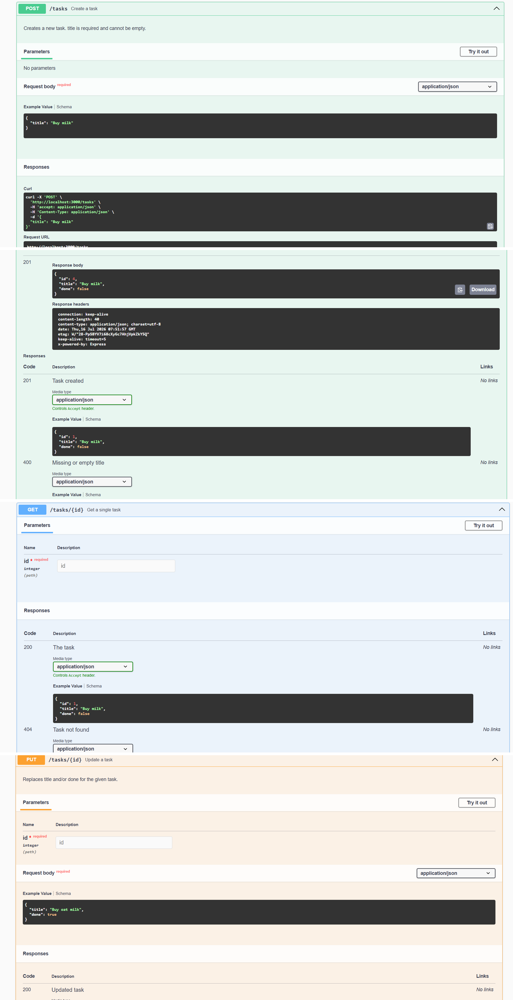
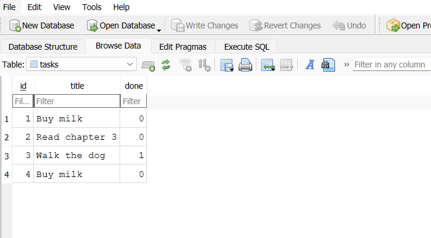
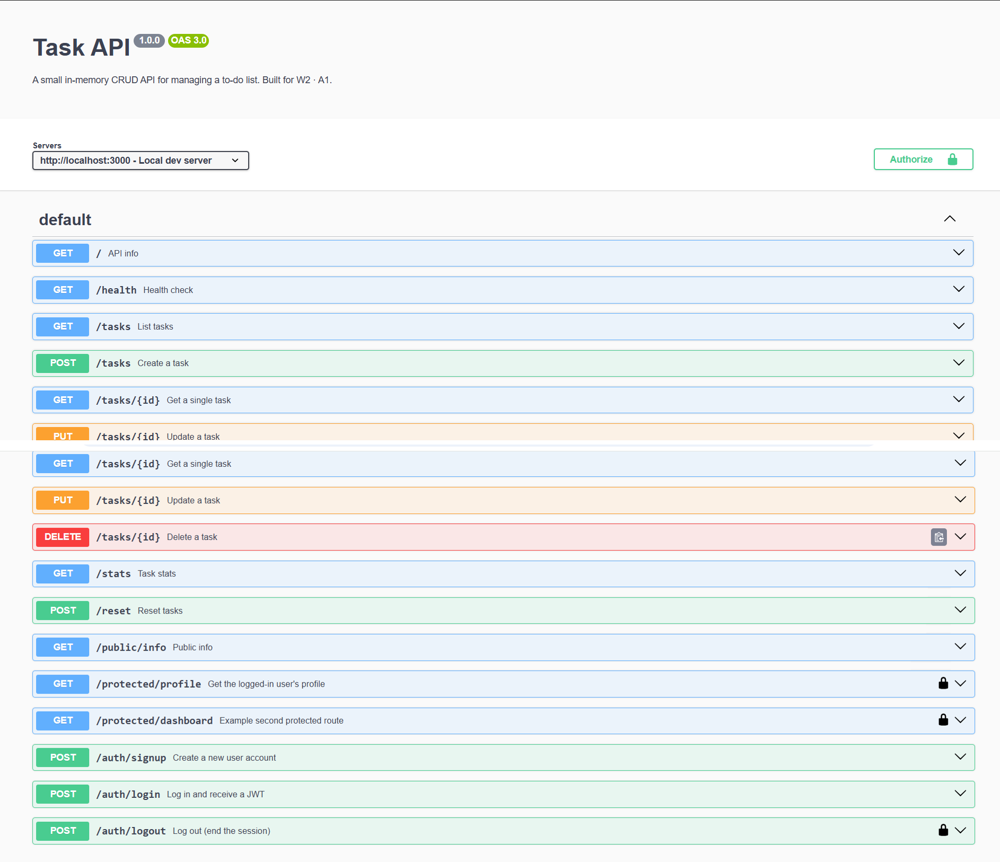

# Task API

A small CRUD API for managing a to-do list. Built with **Node.js + Express**,
persisted in **SQLite**, documented with **Swagger UI**.

- W2 · A1 — built the CRUD API (in-memory)
- W3 · A1 — swapped the storage layer to SQLite (this update) — same
  endpoints, same request/response shapes, but data now survives a restart

## What this is

A backend that supports the four CRUD operations on a list of tasks:
Create (`POST`), Read (`GET`), Update (`PUT`), and Delete (`DELETE`). Tasks
are stored in a SQLite database file (`tasks.db`), not in memory — so
restarting the server no longer wipes your data.

## Why SQLite

- **Zero setup** — no separate database server to install or run; the whole
  database is one file, `tasks.db`.
- **Automatic creation** — the first time the app runs, it opens (and
  therefore creates) `tasks.db`, creates the `tasks` table if it's missing,
  and seeds 3 example tasks only if the table is empty.
- **Good fit for this stage of the project** — simple, file-based, easy to
  inspect by hand in a viewer like DB Browser for SQLite. Moving to
  Postgres/MySQL later is mostly a matter of swapping the storage layer
  again, since the API itself doesn't change.

## Where the database file lives

`tasks.db` is created at the project root the first time you run the app.
It's **git-ignored** — every fresh clone starts with a clean, auto-created
database rather than shipping a binary data file in the repo.

## How to install & run

```bash
npm install
npm start
```

The server starts on **http://localhost:3000**. Swagger UI is at
**http://localhost:3000/docs**. On first run, `tasks.db` is created
automatically with 3 seeded tasks.

## Endpoints

| Method | Path | Description | Success | Errors |
|---|---|---|---|---|
| GET | `/` | API info | 200 | — |
| GET | `/health` | Health check | 200 | — |
| GET | `/tasks` | List all tasks (supports `?done=`, `?search=`, `?limit=&offset=`) | 200 | — |
| GET | `/tasks/:id` | Get a single task | 200 | 404 unknown id |
| POST | `/tasks` | Create a task (`{ "title": "..." }`) | 201 | 400 missing/empty title |
| PUT | `/tasks/:id` | Update title and/or done | 200 | 400 invalid body, 404 unknown id |
| DELETE | `/tasks/:id` | Delete a task | 204 | 404 unknown id |
| GET | `/stats` | `{ total, done, open }` counts (via SQL `COUNT()`) | 200 | — |
| POST | `/reset` | Restore the 3 seed tasks | 200 | — |

All CRUD operations run parameterized SQL queries (`?` placeholders) —
nothing is glued into a query string, which is what keeps user input from
being able to break or attack the database.

## Example: full CRUD cycle with curl

```bash
curl -X 'POST' 'http://localhost:3000/tasks' \
  -H 'accept: application/json' \
  -H 'Content-Type: application/json' \
  -d '{"title": "Buy milk"}'
```

Sample output:

```
HTTP/1.1 201 Created
Content-Type: application/json; charset=utf-8

{"id":4,"title":"Buy milk","done":false}
```

```bash
# Read
curl -i http://localhost:3000/tasks/4

# Update
curl -i -X PUT http://localhost:3000/tasks/4 \
  -H "Content-Type: application/json" \
  -d '{"title":"Buy oat milk","done":true}'

# Delete
curl -i -X DELETE http://localhost:3000/tasks/4

# Confirm it's gone
curl -i http://localhost:3000/tasks
```

## Swagger UI

Open `http://localhost:3000/docs` and use "Try it out" on any endpoint to run
the full create → read → update → delete cycle from the browser, no curl
needed.



## Exploring the database by hand (Stage 4)

Opened `tasks.db` in [DB Browser for SQLite](https://sqlitebrowser.org/) and
ran the queries from the assignment directly against it. Full write-up with
actual results: [`sql-notes.md`](sql-notes.md).

One example — this query:

```sql
SELECT * FROM tasks WHERE done = 1;
```

returned only the completed tasks, e.g. `3 | Walk the dog | 1` — and the
same result appeared instantly through `GET /tasks?done=true` with no
server restart, since the API and DB Browser read the exact same file.



## Persistence proof (the "un-mortality" experiment)

Create a task, restart the server (`Ctrl+C` then `npm start` again), then
`GET /tasks`. Unlike the W2 in-memory version, the task you added is **still
there** — because it now lives in `tasks.db` on disk, not in a JavaScript
array that disappears when the process exits. Restarting also does **not**
re-seed or duplicate the 3 example tasks, since they're only inserted the
first time the table is empty.

## Optional extras included

- **Filtering** — `GET /tasks?done=true` (SQL `WHERE done = ?`)
- **Search** — `GET /tasks?search=milk` (SQL `LIKE`)
- **Stats** — `GET /stats` (SQL `COUNT(*)`)
- **Seed & reset** — `POST /reset`
- **Pagination** — `GET /tasks?limit=2&offset=2` (SQL `LIMIT`/`OFFSET`)

## Project structure

```
todo-api/
├── index.js            # Express server — all routes and logic
├── db.js               # Opens/creates tasks.db, creates the table, seeds it
├── openapi.json         # Hand-written OpenAPI spec, powers Swagger UI at /docs
├── sql-notes.md         # Stage 4 write-up: manual SQL queries and their results
├── package.json
├── .gitignore            # tasks.db is git-ignored — each clone starts fresh
└── README.md
```

## Git history

This repo has one commit per stage across both assignments — W2 · A1
(Stage 0–6, in-memory CRUD) and W3 · A1 (Stage 0–5, SQLite migration).
Clone it and run `npm install && npm start` — `tasks.db` is created and
seeded automatically, no manual setup required.

## W3 · A3 — Containerized stack (Postgres in Docker)

The API now runs against **Postgres, containerized with Docker Compose**,
alongside the SQLite version from A2. Both are implemented behind the same
repository interface (`repositories/`), so `index.js` and every route are
completely unchanged — only the storage layer underneath was swapped, exactly
as A2 set out to prove.

### Run the whole stack with one command

```bash
cp .env.example .env
docker compose up
```

This starts Postgres (with a named volume, so data survives) and the app
together. The app waits for Postgres's healthcheck before starting. On first
boot, Postgres runs `db/init.sql` automatically, creating the `tasks` table
and seeding 3 example tasks.

- API: http://localhost:3000
- Swagger UI: http://localhost:3000/docs
- Postgres: localhost:5432 (user/pass/db from `.env`)

### Architecture: repository interface

```
repositories/
├── index.js                 # picks a driver based on DB_DRIVER / DATABASE_URL
├── sqlite-repository.js     # A2's SQLite storage (fallback, zero setup)
└── postgres-repository.js   # A3's Postgres storage (Docker)
```

Both files implement the exact same functions: `init`, `list`, `getById`,
`create`, `update`, `remove`, `stats`, `reset`. `index.js` only ever calls
`repositories/index.js` — it has no idea which database is actually behind
it. Confirmed honestly: swapping `DB_DRIVER=sqlite` to `DB_DRIVER=postgres`
required editing zero lines in `index.js` or any route.

### `.env` / `.env.example`

`.env` (git-ignored, real values) holds `DATABASE_URL`, the Postgres
credentials, `DB_DRIVER`, and `PORT`. `.env.example` (committed) documents
every variable with safe placeholder values so a clone knows exactly what to
set — just `cp .env.example .env`.

### Persistence proof

Checked two ways:

1. **Via the API** — created a task with `POST /tasks`, ran
   `docker compose down` then `docker compose up` again (stopping and
   restarting *both* the app container and the Postgres container), then
   `GET /tasks` — the task was still there. Ran `docker compose up` a second
   time after that and the 3 seed tasks were **not** duplicated, since
   `init.sql` and the repository's own seed check both only insert when the
   table is empty.
2. **Via the database directly** — connected with `docker compose exec db
   psql -U taskapi -d taskapi -c "SELECT * FROM tasks;"` and saw the same
   rows the API returns, including the one created after a restart.

### Fallback: running without Docker

If Docker isn't available, the app still runs against SQLite exactly like
A2, with zero setup:

```bash
npm install
DB_DRIVER=sqlite npm start
```

## W2 · A4 — Auth: Login & protect (Supabase)

The API is now secured. Supabase Auth is the Identity Provider — it stores
accounts, hashes passwords, and signs JWTs. This server never stores a
password or hashes anything itself; it only forwards credentials to
Supabase and verifies the tokens Supabase hands back.

### Setup

1. Create a free project at [supabase.com](https://supabase.com) (no card).
2. In the dashboard: **Project Settings → API**, copy the **Project URL**
   and the **anon (public) key** — never the `service_role` key.
3. In **Authentication → Sign In / Providers → Email**, turn off "Confirm
   email" so a fresh signup can log in immediately (fine for a practice
   project; you'd leave this on in production).
4. `cp .env.example .env` and fill in `SUPABASE_URL` and `SUPABASE_KEY`
   with your own project's values.
5. `npm install && npm start` (or `DB_DRIVER=sqlite npm start` to skip
   Docker/Postgres for this assignment — auth doesn't depend on which
   task storage backend is active).

Checkpoint: the server logs `Server running and connected to Supabase`
with no errors.

### Endpoints

| Method | Path | Auth required | Description |
|---|---|---|---|
| POST | `/auth/signup` | none | Create a new user account (Supabase) |
| POST | `/auth/login` | none | Authenticate, returns `access_token` + `refresh_token` |
| POST | `/auth/logout` | **Bearer token** | Ends the session |
| GET | `/public/info` | none | Open, unprotected data |
| GET | `/protected/profile` | **Bearer token** | The logged-in user's own profile |
| GET | `/protected/dashboard` | **Bearer token** | Second protected route — proves the same middleware guards more than one route |

Status codes: `201` signup · `200` login/read · `204` logout · `400`
missing/invalid input · `401` missing, malformed, or invalid/expired token.

### How the guard works

`middleware/requireAuth.js` extracts the token from
`Authorization: Bearer <token>`, calls `supabase.auth.getUser(token)` to
verify it against Supabase, and either attaches `req.user` and calls
`next()`, or returns `401`. It's applied to `/protected/profile`,
`/protected/dashboard`, and `/auth/logout` — the same function, three
routes, zero duplicated auth logic.

### Try it

```bash
# 1. Sign up
curl -i -X POST http://localhost:3000/auth/signup \
  -H "Content-Type: application/json" \
  -d '{"email":"test@example.com","password":"password123"}'

# 2. Log in — copy the access_token from the response
curl -i -X POST http://localhost:3000/auth/login \
  -H "Content-Type: application/json" \
  -d '{"email":"test@example.com","password":"password123"}'

# 3. Call a protected route with it
curl -i http://localhost:3000/protected/profile \
  -H "Authorization: Bearer <PASTE_ACCESS_TOKEN_HERE>"

# 4. Tamper with one character of the token and re-run — expect 401
```

Or use Swagger UI at `/docs`: click **Authorize**, paste the access
token, then "Try it out" on `/protected/profile` directly from the
browser.



### Security notes

- `.env` is git-ignored; only `.env.example` (placeholder values) is
  committed. No Supabase keys exist anywhere in this repo's git history.
- Only the **anon** key is used — it's safe to ship in client code and
  cannot bypass Supabase's row-level security. The `service_role` key is
  never used here.
- Logout signs out the session tied to *that specific token*, via a
  request-scoped Supabase client — it doesn't affect other logged-in
  sessions for the same user on other devices.
